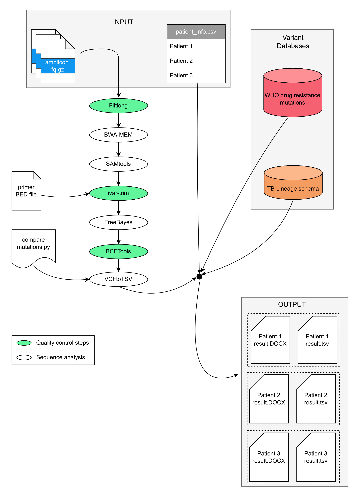

# MAST: Mycobacteria Amplicon Sequencing Tool

[](https://doi.org/10.5281/zenodo.17460753)

[](https://www.nextflow.io/)
[](https://docs.conda.io/en/latest/)

## Introduction

**MAST** is a [Nextflow](https://www.nextflow.io/) pipeline for antimicrobial resistance prediction from *Mycobacterium tuberculosis* amplicon sequencing data.  

The pipeline performs quality control, alignment, primer trimming, variant calling, mutation filtering, and automated report generation. Detected variants are cross-referenced with the World Health Organization (WHO) [catalogue](https://www.who.int/publications/i/item/9789240082410) of mutations and formatted into a customizable patient-facing DOCX report alongside structured TSV outputs.


## Pipeline Summary

1. Read quality trimming  
2. Alignment to the reference genome
3. BAM sorting and indexing  
4. Primer trimming  
5. Variant calling  
6. Variant filtering  
7. Mutation comparison against WHO catalogue  
8. Report generation (DOCX + TSV)


## Requirements

### Software

- Java ≥ 17 (≤ 25)
- Nextflow ≥ 24
- Conda (Miniconda recommended)

### Tested on

- macOS 14.5 (Sonoma)
- Ubuntu 22.04.4 LTS
- Conda-forge (x86_64 platform)

## Installation

Clone the repository:

```
git clone https://github.com/guthrielab/MAST
```

Install Nextflow (if not already installed): 

https://www.nextflow.io/docs/latest/install.html


Verify installation:

```
nextflow -version
```

## Dependencies

MAST uses Conda for environment management.

Main packages:

- python 3.10  
- pandas 2.3.3  
- biopython 1.86  
- python-docx 1.2.0  
- jinja2 3.1.6  
- bcftools 1.17  
- samtools 1.21  
- ivar 1.4.3  
- bwa 0.7.18  
- freebayes 1.3.6  
- cutadapt 5.2  
- filtlong 0.2.1  
- bedtools 2.31.1  
- seqkit 2.12.0  
- pysam 0.22.1  

The environment is automatically created when running with:

```
-with-conda
```

## MAST Tutorial

A small test dataset is available via Zenodo.

### 1. Download test data

Download the dataset from: https://doi.org/10.5281/zenodo.17460753


Place the downloaded file in the parent directory where `MAST` is located.

### 2. Extract files

After extraction, you should have a directory named:

```
17460753
```

This directory should contain:

- 5 `fastq.gz` files  
- `patient_info.csv`

### 3. Replace patient_info.csv

Replace:

```
MAST/Data/patient_info.csv
```

with the `patient_info.csv` file from the `17460753` folder.

### 4. Run the tutorial

From the parent directory of `MAST`, run:

```
nextflow run MAST \
  --input 17460753 \
  --outdir tutorial_output \
  -with-conda
```

### 5. Expected output

You should see output similar to:

```
N E X T F L O W   ~  version 24.04.3

Launching `MAST/main.nf` [angry_mahavira] DSL2

executor >  local (40)
[04/df42cf] runQualityTrimming (1) [100%] 5 of 5 ✔
[8f/a0ff96] runAlignment (4)       [100%] 5 of 5 ✔
[44/f9aa5b] runSortAndIndex (5)    [100%] 5 of 5 ✔
[e4/d72d0a] runPrimerTrimming (5)  [100%] 5 of 5 ✔
[12/1cab06] runVariantCalling (5)  [100%] 5 of 5 ✔
[73/50e189] runFilterVariants (5)  [100%] 5 of 5 ✔
[65/87e21f] runConvertToTSV (5)    [100%] 5 of 5 ✔
[15/8a08d2] compareMutations (5)   [100%] 5 of 5 ✔
Completed
```

The `tutorial_output` directory should contain:

- 5 DOCX reports  
- 5 TSV files  


## Usage

```
nextflow run MAST \
  --input <fastq_folder> \
  --outdir <results_directory> \
  -with-conda
```

### Required parameters

| Parameter | Description |
|------------|-------------|
| `--input`  | Directory containing single-end FASTQ files |
| `--outdir` | Output directory for final reports |


## Input
### FASTQ files

- Single-end sequences
- `.fastq` or `.fastq.gz`
- Filename must match barcode entry in `patient_info.csv`

### patient_info.csv

Located in:

```
MAST/Data/patient_info.csv
```

This file controls:

- Patient metadata
- Report customization
- Barcode matching


## Reference Genome

The pipeline aligns reads to a reference genome for mutation detection.

Default reference genome:

*Mycobacterium tuberculosis* H37Rv

NCBI RefSeq accession: NC_000962.3


## Output

For each input FASTQ file, MAST produces:

- `<barcode>.docx` — formatted resistance report  
- `<barcode>.tsv` — structured mutation output  


## Running on HPC (SLURM)

MAST can be executed on SLURM-based high-performance computing (HPC) systems.

### Request compute resources

If running on a SLURM cluster:

```
salloc --account=<your_account> \
       --cpus-per-task=8 \
       --mem=16G \
       --time=4:00:00
```

Alternatively, submit the pipeline as a batch job using `sbatch` according to your institutional guidelines.

### Work directory permissions

On shared systems, you may not have permission to write to the default `work/` directory if launching from a restricted location.

If you encounter permission errors related to the `work/` directory, define a writable work directory location:

```
export NXF_WORK=/scratch/$USER/nxf_work
mkdir -p $NXF_WORK
```

Then run the pipeline normally. Nextflow will automatically use the directory defined in `NXF_WORK`.

### Ensure Conda is available

```
which conda
conda --version
```

If not found, load or install [Conda](https://docs.conda.io/projects/conda/en/latest/user-guide/install/index.html).


## Resuming a Run

If a run fails:

```
nextflow run MAST \
  --input <fastq_folder> \
  --outdir <results_directory> \
  -with-conda \
  -resume
```

Do not change the work directory when using `-resume`.


## Troubleshooting

| Error | Cause | Solution |
|-------|-------|----------|
| `conda: command not found` | Conda not in PATH | Install or load Conda |
| `Process requirement exceeds available CPUs` | Running on login node | Request SLURM allocation |
| `Unable to create directory .../work` | No write permissions | Set `NXF_WORK` |
| `Another Nextflow instance is creating the conda environment` | Interrupted run | Run `nextflow clean -f` |
| `PackagesNotFoundError` | Apple Silicon Machine (osx-arm64) | Apple Silicon (arm64) chip is currently not supported due to Bioconda build limitations. Use a Linux machine or ensure you installed the x86_64 (intel) version of conda-forge on your Apple machine |


## Caching

Nextflow caches intermediate files in the `work/` directory.

To clean:

```
nextflow clean -f
```


## Workflow Diagram




## Citation

If you use MAST, please cite:

https://doi.org/10.5281/zenodo.17460753


## License

GPL-3.0 license

## Contact

For questions or issues, please open a GitHub issue in the repository.
